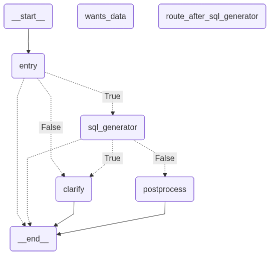

# QueryBridge  

A **GenAI-powered unified query platform** that enables users to ask questions in plain English and get answers across multiple databases — without writing SQL or worrying about where the data lives.  

---

## 📖 Project Overview  

Business data often lives in **different systems** (ERP, cloud warehouses, spreadsheets), making insights slow and error-prone.  

**QueryBridge** solves this by:  

- Dynamically routing natural language queries to the correct data source  
- Auto-generating SQL and fetching results  
- Performing lightweight post-processing  
- Returning both structured data and **smart visualizations**  

## 🛠️ Tech Stack  

- **Python** – core backend logic  
- **DuckDB** – local query engine for Excel/CSV  
- **Google BigQuery Python SDK** – access to BigQuery  
- **SAP HANA DBAPI** – integration with enterprise HANA DB  
- **Pandas** – in-memory data processing  
- **Matplotlib / Plotly** – visualization  
- **LangGraph** – orchestration of LLM reasoning steps  
- **Streamlit** – user interface  

---

## ✨ Key Features  

- ✅ Single query interface across multiple databases  
- ✅ No SQL knowledge required  
- ✅ Dynamic routing + auto SQL generation  
- ✅ Post-query insights & suggested charts  
- ✅ Lightweight, portable, and extensible (Snowflake, APIs, etc.)  

---
Flow diagram

 

## 🚀 Running the Project  

 **Run the Streamlit app**

```bash
Copy
Edit
streamlit run app.py
